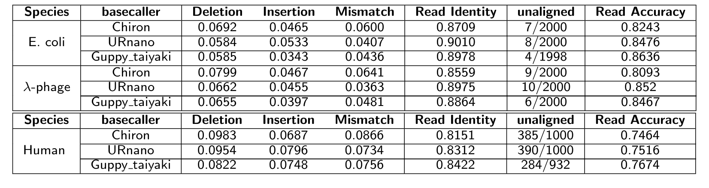

# URnano: Nanopore base-calling from a perspective of instance segmentation

URnano is a nanopore base-caller that performing base-calling as a multi-label segmenation task.
More details can be found in [BioAxiv](https://www.biorxiv.org/content/10.1101/694919v1).

## Docker enviroment
We provide a docker image for running this code
```
docker pull yaozhong/keras_r_tf:1.8
```

* ubuntu 14.04.4
* Tensorflow 1.8.0
* Keras 2.2.4

```
nvidia-docker run -it --rm yaozhong/keras_r_tf:1.8 bash
```

## Data
We use curated data provided by Chiron, which can be downloaded from http://dx.doi.org/10.5524/100425.

## Training
```
# setting model parameters
## Network structure
MODEL="../experiment/model/URnet.model.parameters.json"
## Training data cache
TRAINDATA="../data/cache/train.h5"
## If no data cache is given, provide the signal and labels as used in Chiron.
TRAIN_IN="../data/chiron_data/train/"
## Currency strength statistics saving path
NORM_FILE_SAVE="../experiment/model/statistics/all_data_stats.pickle"

python train_urnet.py -cf $TRAINDATA -i $TRAIN_IN -mp $MODEL -l $LOSS -nID 3 -fSignal 10 -norm $NORM_FILE_SAVE -tag URnet.all
```


## Testing
### (1). Non-overlapping evluation
```
## Network structure
MODEL="../experiment/model/URnet.model.parameters.json"
LOSS="ce_dice_loss"
TESTDATA="../data/cache/test.h5"
## If no data cache is given, provide the signal and labels as used in Chiron.
TEST_IN="../data/chiron_data/test/"
## Currency strength statistics saving path
NORM_FILE_SAVE="../experiment/model/statistics/all_data_stats.pickle"

python test_urnet.py -tm plt -cf $TESTDATA -i $TEST_IN -mp $MODEL -l $LOSS -nID 3 -norm $NORM_FILE_SAVE -tag URnet.all
```


### (2). whole read base-calling from fast5
```
spiece="ecoli"
SIGNAL_FOLD="../data/chiron_data/paper_eval/unet_result/signals/ecoli/"
OUTPUT="../experiment/basecall/basecalling_clip/$spiece/"
MODEL="../experiment/model/Unet.model.parameters.json"
LOSS="ce_dice_loss"
NORM_FILE_SAVE="../experiment/model/statistics/all_data_stats.pickle"

python fast5_test_urnet.py -i $SIGNAL_FOLD -it signal -o $OUTPUT -mp $MODEL -loss $LOSS -nID 3 -norm $NORM_FILE_SAVE -tag URnet.all
```

### Results

We have compared the basecalling performance of URnano with other basecallers, i.e. [Chiron](https://github.com/haotianteng/Chiron) and [Guppy](https://github.com/nanoporetech/taiyaki).
In order to have a fair comparison we trained and tested all models on the same datasets. Below are the raw accuracy results for each basecaller:



### Assembly Results 

In order to compare URNano fairly with other basecallers we used the same pipeline used for evaluating [Chiron](https://github.com/haotianteng/Chiron). Below is the line of commands need to be run in order to create assemblies with 10 rounds of polishing. We used the following external tools with their versions :

- Minimap2 : 2.17-r943-dirty
- Miniasm : 0.3-r179
- Racon : v1.4.6

After installing the external tools you can do assemblies using the following lines of commands : 


'''
RACON=/home/aakdemir/racon/build/bin/racon
raw_read=${1}
out_folder=${2}
if [ ! -d "${out_folder}" ]; then
    echo "ARDA"
    mkdir ${out_folder}
    mkdir ${out_folder}"/racon_assembly"
    mkdir ${out_folder}"/racon_assembly/consensus"
fi

out_file="${out_folder}/racon_assembly/consensus/"
echo $out_file
if [ ! -f "${out_file}merge_1_par.fastq" ]; then
    cp ${raw_read} ${out_file}"merge_1_par.fastq"
fi

minimap2/minimap2 -x ava-ont -k12 -w5  ${out_file}merge_${i}_par.fastq ${out_file}merge_${i}_par.fastq > ${out_file}reads_${i}.paf
miniasm/miniasm   -f   ${out_file}merge_${i}_par.fastq ${out_file}reads_${i}.paf > ${out_file}raw_contigs_${i}.gfa
awk '$1 ~/S/ {print ">"$2"\n"$3}' ${out_file}raw_contigs_${i}.gfa > ${out_file}raw_contigs_${i}.fasta
echo "Running minimap with raw_contigs and merge_1_par.fastq"
minimap2/minimap2   ${out_file}raw_contigs_${i}.fasta ${out_file}merge_${i}_par.fastq > ${out_file}mapping_${i}.paf
echo "Racon mapping"
${RACON}   ${out_file}merge_${i}_par.fastq ${out_file}mapping_${i}.paf ${out_file}raw_contigs_${i}.fasta > ${out_file}consensus_${i}_0.fasta


## 10 rounds of  polishing
for j in 0 1 2 3 4 5 6 7 8 9 10
do
    minimap2/minimap2  ${out_file}consensus_${i}_${j}.fasta ${out_file}merge_${i}_par.fastq > ${out_file}map${i}_${j}.paf
    ${RACON}   ${out_file}merge_${i}_par.fastq ${out_file}map${i}_${j}.paf  ${out_file}consensus_${i}_${j}.fasta >  ${out_file}consensus_${i}_$((j+1)).fasta

done

'''


## Acknowledgement
We thank Chiron authors for providing [source code](https://github.com/haotianteng/Chiron) and [dataset](http://gigadb.org/dataset/100425).
The signal reading part and merging of base-calling results for a whole read part are revised based on Chiron (V0.3)'s code following MPL 2.0.
